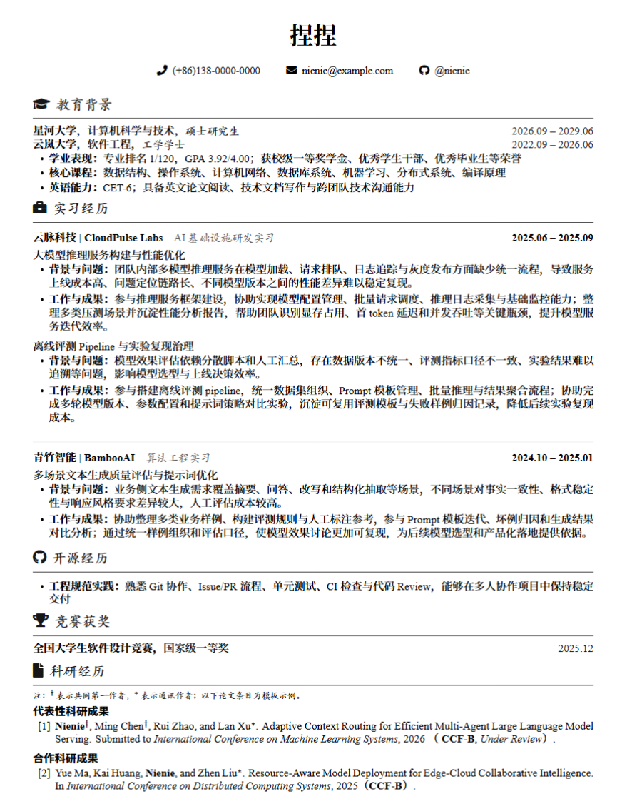

一个简洁的中文技术简历 LaTeX 模板。

### 使用方法

1. 克隆项目：

```bash
git clone https://github.com/Echo-Nie/resume_template.git
```

2. 进入项目目录：

```bash
cd resume_template
```


3. 使用 XeLaTeX 编译：

```bash
xelatex resume.tex
```
也可以直接上传至 Overleaf 在线编辑和编译。


### 预览




## License

This project is licensed under the MIT License. See the [LICENSE](./LICENSE) file for details.
